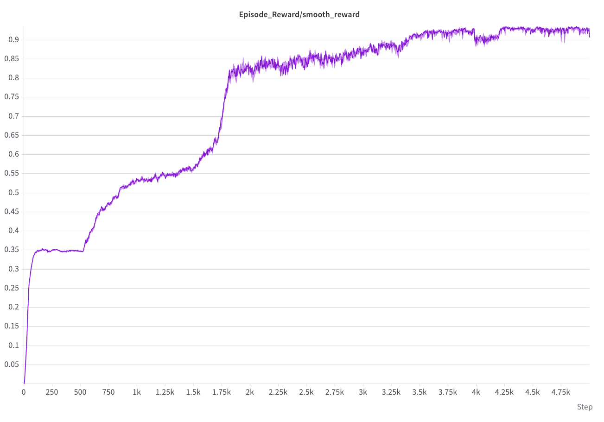
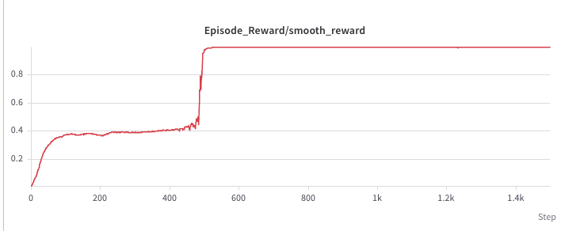
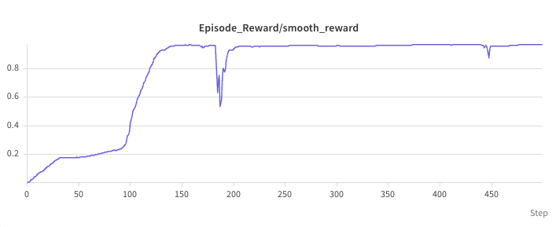

## Q1-5
★ **Q1:** Which joints are actuated, and how can you tell from the XML
   alone?

Only the slider, in the XML it is surrounded by the actuator block; you can also tell based on the name that a slider actually involves real motoring force whereas hinges are constraints.


★ **Q2:** What is the total actor observation dimension, and why is the
pole angle 2 numbers instead of 1?

The total actor observation dimension is the sum of all the actor term dimensions, which is the sum of cart_pos, pole_angle, cart_vel and pole_vel, which evaluates to 1 + 2 + 1 + 1 = 5. 

The pole angle is given as $\sin$ and $\cos$, where $\theta$ is the current angle. Because $\theta \in [-\pi, \pi]$, sudden jumps may occur that change the value drastically. Passing in sin and cos values remove that jump.


★ **Q3:** With `--agent zero` in Balance mode, roughly what reward does
viser show, and why isn't it exactly 1.0? (Hint: reset events.)

--agent zero means that the agent takes no action, i.e. we only see how the system reacts on its own. If $x, \theta = (0,0)$ at start, 
- the upright reward is 1 
- the centered reward is slightly less than 1 due to random offsets at reset
- the small control reward is  1 because `control` is 0 at start.
- the small velocity is slightly less than 1 due to random offsets at reset
consequently, the reward should be approximately 1. However, the reset slider and hinge events cause the pole to be off by a small offset, which can cause velocities to emerge and result in the small control and velocity rewards to decrease. the system starts in unstable equilibrium and can quickly change. From my observation, the reward starts at 0.9977 at 16 steps and oscillates between 0.3 - 0.9 as the pole swings from 40+ steps. 

★ **Q4:** From the log: roughly how many env-steps/second did you get?

I selected the results from iterations 42-45 and found the average steps/second to be 408707. 

★ **Q5:** Play the resulting checkpoint (use the Step 6 command with the
cartpole task). Describe in one or two sentences what the policy does.

The agent swings the slider towards the edge, creating just enough momentum for the stick to stay on top of the slider without falling, thus completing the swingup challenge perfectly, and demonstrating elite control of force. 

## Reward design 

I ran everything in *one full iteration*, notwithstanding the failed runs due to setup issues. The rewards required a good amount of thought and tradeoff between intuition, so I will detail my design below. 

The changes in reward design for our double case compared with the single pendulum case occurred in the upright and small velocity rewards. Namely, I defined 

```python
  hinge1_angle = asset.data.joint_pos[:, hinge1_cfg.joint_ids].squeeze(-1)
  hinge2_angle = asset.data.joint_pos[:, hinge2_cfg.joint_ids].squeeze(-1)
  upright = ((torch.cos(hinge1_angle)  + 1) / 2 + (torch.cos(hinge1_angle+hinge2_angle) + 1) / 2) / 2
```
for the upright angle case. Let's unpack: 
$$ U = \frac{1}{2}\left(\frac{\cos(\theta_1)+1}{2} + \frac{\cos({\theta_1 + \theta_2})+1}{2}\right)$$
is the formula I arrived at, where $\theta_1$ is the angle between the pendulum and the vertical, and $\theta_2$ is the relative angle between the second and first pendulums. 


The design is quite intuitive. Each pole should be vertical. Pole 1's angle from vertical is $\theta_1$ and $\theta_2$ is measured relative to pole 1. Pole 2's angle from vertical is $\theta_1 + \theta_2$. The term $(\cos(\theta)+1)/2$ is 1 when that pole points straight up and 0 when it points straight down. So $U = 1$ only at $\theta_1 = \theta_2 = 0$ and $U = 0$ at $\theta_1 = \pi, \theta_2 = 0$. 

A few design choices:

- Using $\cos\theta_2$ alone is insufficient as it only measures if the pole 2 is aligned with pole 1, which could potential hinder / slow down training. 
- I also considered $ U = \left(\frac{\cos(\theta_1)+1}{2} * \frac{\cos({\theta_1 + \theta_2})+1}{2}\right)$, where the only difference is the product between the terms instead of the mean, e.g. geometric mean. However, intuitatively this would require the model to optimize simultaneously the pole 1 and pole 2 angles instead of first optimizing for 1 and then 2. The mean form seemed to have better numerical stability, so I tried the mean form immediately and the numerical results were strong. 


For the small velocity, I updated the form to be 
```python
  small_velocity = (1 + _gaussian_tolerance(hinge1_vel, margin=5.0)*_gaussian_tolerance(hinge2_vel,margin=5.0)) / 2
```
which is a product between the two tolerances. The two gaussian filters already map values between $[0,1]$, so a product also preserves the form. The design choice was similar to the slight distinction made in the design choice above, but I think it makes more sense to optimize for the joint velocity for pole 1 and 2 to both be small simultaneously, so that the operation is smooth from the get go. 

## short explaination
(a) Double pendulums are [naturally chaotic](https://www.youtube.com/watch?v=dtjb2OhEQcU), meaning that from small starting velocities it is possible to reach a fast blowup in velocity. It is therefore sensible to termiante early when such cases happen and train the model to avoid such trajectories. 

Moreover, large velocities can result in NaN values due to numerical instability, which will nuke the entire PPO batch across 4096 envs. 

The 50rad/s limit will not constraint normal learning because it is far above the real swingup or balance speeds. 

(b) The pole is "falling over" in the start case, so trating the poll fell over as a failure would result in immediate termination, which is undesirable for our training. 

Furthermore, it is natural for the swing up process to cover suboptimal states which can be seen as falling over, especially because the propagation of angular momentum will result in the second pole bending a bit and seemingly fall over. 

Finally, the reward penalizes falling over because it will receive ~ 0 on the upright reward, which causes the entire reward to approach zero. The policy will naturally dodge such cases. 

## Training curves




## Metadata
- Task id: `Course-Cartpole-Double-Swingup`
- Run directory: `logs/rsl_rl/cartpole_double/2026-09-17_03-41-01`
- Checkpoint: `model_4999.pt` 

Supporting run: `Course-Cartpole-Double-Balance`, `logs/rsl_rl/cartpole_double/2026-09-17_03-11-58/model_1499.pt`.